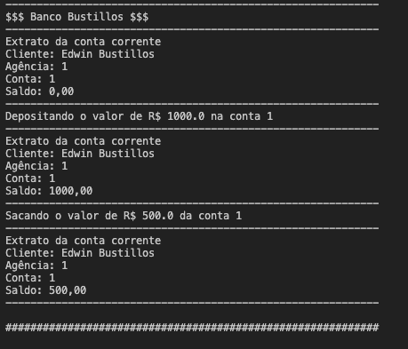
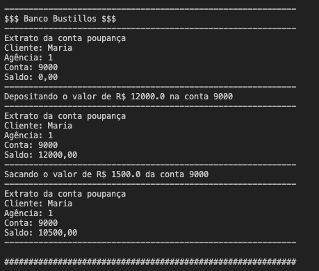
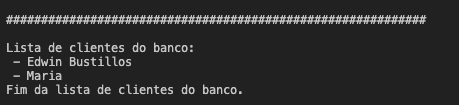

# Banco Digital
Este é um projeto simples de simulação de um banco. Ele foi desenvolvido em Java e demonstra operações bancárias básicas como depósito, saque e geração de extrato.

## Screenshots
 

  
  
  

## Funcionalidades
- Clientes: O banco pode ter vários clientes. Cada cliente tem um nome.
- Contas: Cada cliente pode ter uma conta corrente ou uma conta poupança.
- Operações bancárias: Os clientes podem depositar e sacar dinheiro de suas contas. Eles também podem gerar um extrato de suas contas.

## Como usar
Para usar este projeto, você precisa ter o Java instalado em seu sistema. Depois de instalar o Java, você pode compilar e executar o arquivo Banco.java para iniciar a simulação do banco.

## Contribuindo
Contribuições são bem-vindas! Sinta-se à vontade para abrir um problema ou enviar um pull request.
